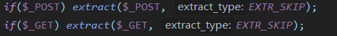
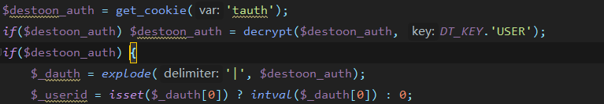
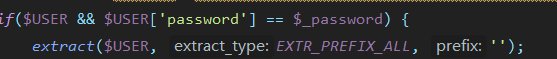

# 1Destoon笔记

## common.inc.php 

### common.inc.php 引入的文件有

- /include/rewrite.inc.php
- /config.inc.php
- /include/global.func.ph
- /include/tag.func.php
- /api/im.func.php
- /api/extend.func.php
- /lang/{$lang}/lang.inc.php
- /include/db{$DB_TYPE}.class.php
- /include/cache_{$CACHE_TYPE}.class.php
- /incldue/session_{$SESSION_TYPE}.class.php
- /include/file.func.php

### common.inc.php 定义及使用的常量有

| 常量名       | 常量描述                   |
| ------------ | -------------------------- |
| DT_DEBUG     | 调试模式配置               |
| IN_DESTOON   |                            |
| DT_ADMIN     |                            |
| IN_ADMIN     |                            |
| DT_ROOT      | 根目录                     |
| DT_REWRITE   | 是否路由重写               |
| DT_PATH      |                            |
| DT_STATIC    |                            |
| DT_DOMAIN    |                            |
| DT_WIN       | 是否是WINDOWS系统          |
| DT_CHMOD     |                            |
| DT_LANG      | 语言                       |
| DT_KEY       |                            |
| DT_PRE       |                            |
| DT_EDITOR    |                            |
| DT_CDN       |                            |
| DT_CLOUD_UID |                            |
| DT_CLOUD_KEY |                            |
| DT_CHARSET   |                            |
| DT_CACHE     | 缓存路径                   |
| DT_SKIN      |                            |
| VIP          |                            |
| errmsg       |                            |
| DT_TIME      |                            |
| DT_IP        | 客户端IP                   |
| DT_TOUCH     | 是否是触屏设备             |
| DT_MAX_LEN   |                            |
| DT_MOB       | 判断移动端是 app weixin 等 |
| RE_WRITE     |                            |
| DT_BOT       | 是否是机器 爬虫 蜘蛛       |
|              |                            |

### 常用变量

| 变量      | 描述                       |
| --------- | -------------------------- |
| $DT_PRE   |                            |
| $DT_QST   |                            |
| $DT_TIME  |                            |
| $DT_IP    | 客户端IP                   |
| $DT_URL   | 请求的URL                  |
| $DT_REF   | 请求的来源页               |
| $DT_MOB   | 判断移动端是 app weixin 等 |
| $DT_BOT   | 是否是机器 爬虫 蜘蛛       |
| $DT_TOUCH | 是否是触屏设备             |
| $DT_PC    |                            |

### 其他

- 将GET POST 过来的数据进行处理 以key为变量名 value为变量值进行处理

- cookie 中存有用户的ID信息 需要调用decrypt 函数进行解密

- 数据库中的用户字段可以直接使用 因为

  